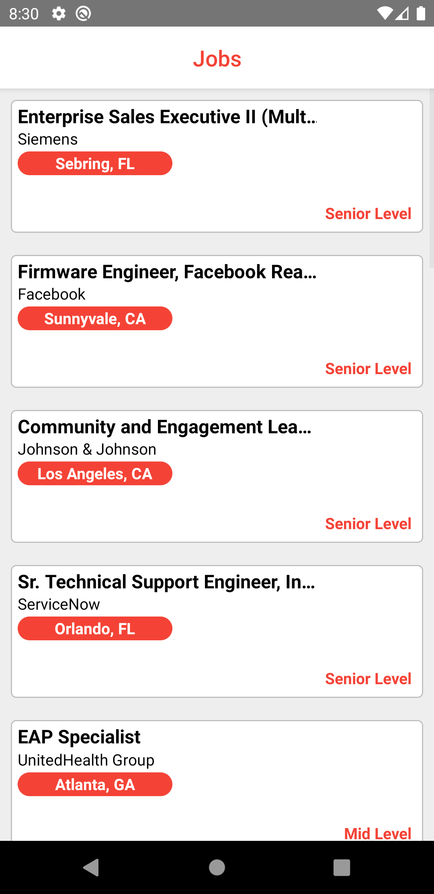
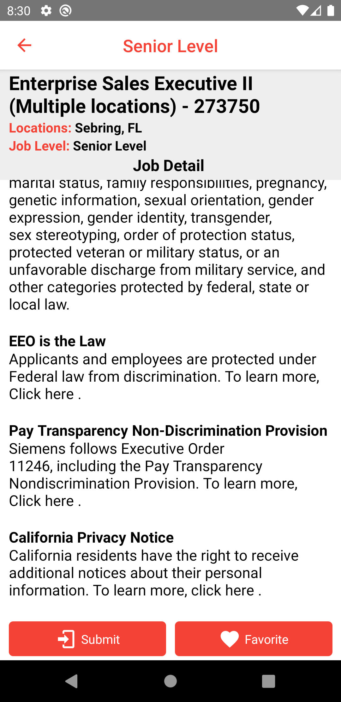
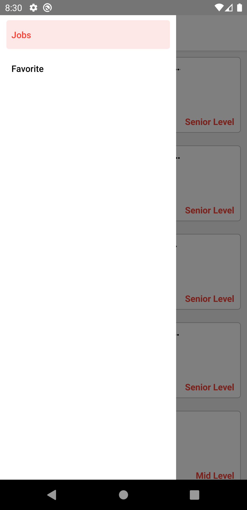
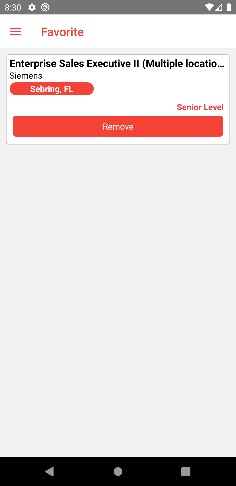

# Kodwork

 
 
 

## Teknoloji

React Native

## Özellikler

- Bir Web API ile iş ilanlarını listeleme.
- Verilerin yüklendiği sırada bir loading işlemi gerçekleştirme.
- İlanları favori listesine ekleme.
- Favori listesinde eklenen ilanları listeleme.
- Favori listesindeki ilanları silme.

## Kurulum

Bu depoyu yerel makinenizde klonlayın.

```
git clone https://github.com/ibrahimaykutbas/Kodwork.git
```

### Hazırlık

Projeyi klonladıktan sonra ilgili dizine gidin.

```
cd Kodwork
code .
```

Proje bağımlılıklarını yüklemek için proje dizininde aşağıdaki komutları çalıştırın.

```
npm install
-veya-
yarn
```

Eğer macOS kullanıyorsanız ve iOS işletim sistemine sahip bir cihazda projeyi başlatacaksanız pod'ları yükleyin.

```
cd ios
pod install
```

### Kullanım

Projeyi başlatmak için aşağıdaki komutları kullanın.

```
npx react-native run-android
-veya-
npx react-native run-ios
```

Bu talimatlar, geliştirme ve test amacıyla yerel makinenizde projenin bir kopyasını hazır ve çalışır hale getirecektir.

## Daha Fazla Bilgi İçin

Daha fazlasını şuradan öğrenebilirsiniz: [React documentation](https://reactnative.dev/)
